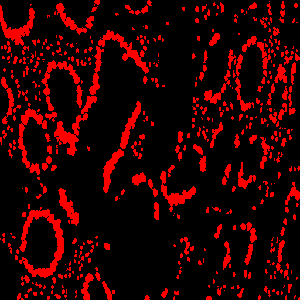
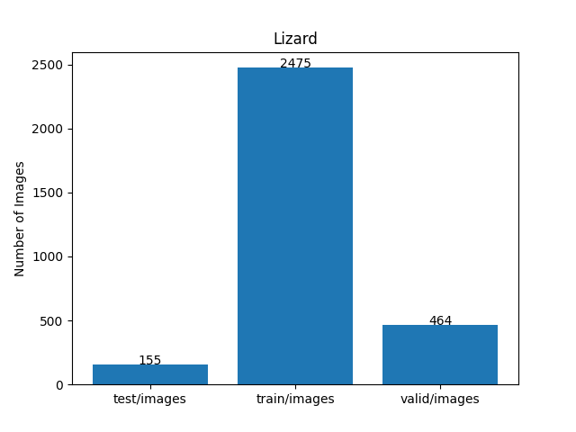
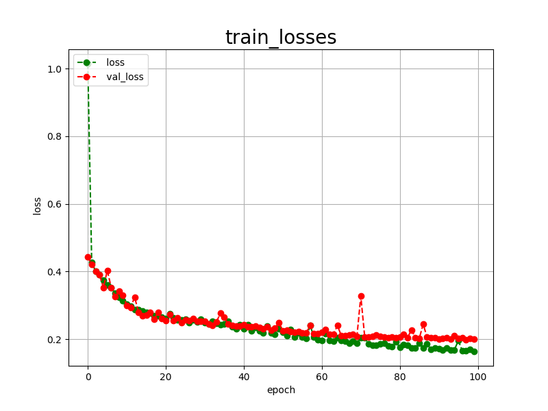
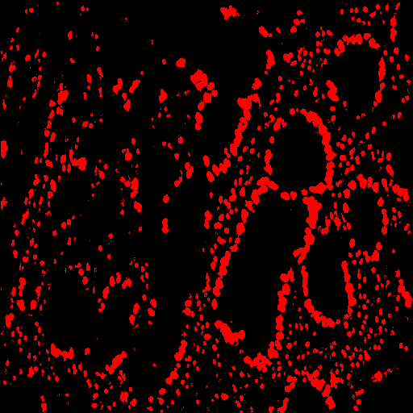

<h2>TensorFlow-FlexUNet-Image-Segmentation-Lizard (2025/08/02)</h2>

This is the first experiment of Image Segmentation for Lizard Multiclass (consep, crag, dpath, glas and pannuke),
 based on our 
TensorFlowFlexUNet (TensorFlow Flexible UNet Image Segmentation Model for Multiclass) 
and a 512x512 pixels 
<a href="https://drive.google.com/file/d/1IIa7SwxcNKYV4gzaP7V5AQmy0xs42_Lz/view?usp=sharing">
Augmented-Lizard-ImageMask-Dataset.zip</a>.
which was derived by us from 
<a href="https://www.kaggle.com/datasets/aadimator/lizard-dataset">
<b>Lizard dataset</b> </a> on the kaggle web-site
 
 
<b>Acutual Image Segmentation for 512x512 Lizard images</b> 
As shown below, the inferred masks predicted by our segmentation model trained on the 
PNG dataset appear similar to the ground truth masks, but lack precision in some areas, 
 
The green represents a consep, the yellow a crag, the cyan a dpath, the red a glas, and the blue a pannuke
respectively. 

 
<table>
<tr>
<th>Input: image</th>
<th>Mask (ground_truth)</th>
<th>Prediction: inferred_mask</th>
</tr>
<tr>
<td></td>
<td></td>
<td></td>
</tr>
<tr>
<td></td>
<td></td>
<td></td>
</tr>
<tr>
<td></td>
<td></td>
<td></td>
</tr>
</table>

 
<h3>1. Dataset Citation</h3>
The dataset used here has been taken from the kaggle web-site: 

<a href="https://www.kaggle.com/datasets/aadimator/lizard-dataset">
<b>Lizard dataset</b>
</a>
<b>The largest known nuclear instance segmentation and classification dataset</b>
 
 
<b>About Dataset</b> 
The development of deep segmentation models for computational pathology (CPath) can help foster the investigation of 
interpretable morphological biomarkers. Yet, there is a major bottleneck in the success of such 
approaches because supervised deep learning models require an abundance of accurately labelled data. 
This issue is exacerbated in the field of CPath because the generation of detailed annotations usually demands the 
input of a pathologist to be able to distinguish between different tissue constructs and nuclei. 
Manually labelling nuclei may not be a feasible approach for collecting large-scale annotated datasets, especially 
when a single image region can contain thousands of different cells. Yet, solely relying on automatic generation 
of annotations will limit the accuracy and reliability of ground truth. Therefore, to help overcome the above challenges, 
we propose a multi-stage annotation pipeline to enable the collection of large-scale datasets for histology image analysis, 
with pathologist-in-the-loop refinement steps. Using this pipeline, we generate the largest known nuclear instance segmentation
 and classification dataset, containing nearly half a million labelled nuclei in H&E stained colon tissue. 
 We will publish the dataset and encourage the research community to utilise it to drive forward the development of 
 downstream cell-based models in CPath.

Link to the dataset paper <a href="https://arxiv.org/abs/2108.11195">Lizard: A Large-Scale Dataset for Colonic Nuclear Instance Segmentation and Classification</a>.
 
 
<b>Citation</b> 
@inproceedings{graham2021lizard, 
  title={Lizard: A Large-Scale Dataset for Colonic Nuclear Instance Segmentation and Classification}, 
  author={Graham, Simon and Jahanifar, Mostafa and Azam, Ayesha and Nimir, Mohammed and Tsang,  
  Yee-Wah and Dodd, Katherine and Hero, Emily and Sahota, Harvir and Tank, Atisha and Benes, Ksenija and others}, 
  booktitle={Proceedings of the IEEE/CVF International Conference on Computer Vision}, 
  pages={684--693}, 
  year={2021} 
} 
 

<h3>
<a id="2">
2 Lizard ImageMask Dataset
</a>
</h3>
 If you would like to train this Lizard Segmentation model by yourself,
 please download the dataset from the google drive  
<a href="https://drive.google.com/file/d/1IIa7SwxcNKYV4gzaP7V5AQmy0xs42_Lz/view?usp=sharing">
Augmented-Lizard-ImageMask-Dataset.zip</a>.
 
, expand the downloaded ImageMaskDataset and put it under <b>./dataset</b> folder to be
<pre>
./dataset
└─Lizard
    ├─test
    │   ├─images
    │   └─masks
    ├─train
    │   ├─images
    │   └─masks
    └─valid
        ├─images
        └─masks
</pre>
 
<b>Lizard Statistics</b> 
 
 
On the derivation of the dataset, please refer to our repository 
<a href="https://github.com/sarah-antillia/Tensorflow-Image-Segmentation-Pre-Augmented-Lizard-Consep">
Tensorflow-Image-Segmentation-Pre-Augmented-Lizard-Consep</a>
  

<!--
On the derivation of the dataset, please refer to the following Python scripts: 
<li><a href="./generator/ImageMaskDatasetGenerator.py">ImageMaskDatasetGenerator.py</a></li>
<li><a href="./generator/split_master.py">split_master.py</a></li>
 
-->
As shown above, the number of images of train and valid datasets is not so large to use for a training set of our segmentation model.
 
 
<b>Train_images_sample</b> 

 
<b>Train_masks_sample</b> 

 
<h3>
3 Train TensorFlowFlexUNet Model
</h3>
 We trained Lizard TensorFlowFlexUNet Model by using the following
<a href="./projects/TensorFlowFlexUNet/Lizard/train_eval_infer.config"> <b>train_eval_infer.config</b></a> file.  
Please move to ./projects/TensorFlowFlexUNet/Lizard and run the following bat file. 
<pre>
>1.train.bat
</pre>
, which simply runs the following command. 
<pre>
>python ../../../src/TensorFlowFlexUNetTrainer.py ./train_eval_infer.config
</pre>

<b>Model parameters</b> 
Defined a small <b>base_filters = 16 </b> and large <b>base_kernels = (9,9)</b> for the first Conv Layer of Encoder Block of 
<a href="./src/TensorFlowFlexUNet.py">TensorFlowFlexUNet.py</a> 
and a large num_layers (including a bridge between Encoder and Decoder Blocks).
<pre>
[model]
;You may specify your own UNet class derived from our TensorFlowFlexModel
model         = "TensorFlowFlexUNet"
generator     =  False
image_width    = 512
image_height   = 512
image_channels = 3
num_classes    = 6

base_filters   = 16
base_kernels   = (9,9)
num_layers     = 8
dropout_rate   = 0.04
dilation       = (1,1)
</pre>
<b>Learning rate</b> 
Defined a very small learning rate.  
<pre>
[model]
learning_rate  = 0.00007
</pre>
<b>Loss and metrics functions</b> 
Specified "categorical_crossentropy" and <a href="./src/dice_coef_multiclass.py">"dice_coef_multiclass"</a>. 
<pre>
[model]
loss           = "categorical_crossentropy"
metrics        = ["dice_coef_multiclass"]
</pre>
<b>Dataset class</b> 
Specifed <a href="./src/ImageCategorizedMaskDataset.py">ImageCategorizedMaskDataset</a> class. 
<pre>
[dataset]
class_name    = "ImageCategorizedMaskDataset"
</pre>
 
<b>Learning rate reducer callback</b> 
Enabled learing_rate_reducer callback, and a small reducer_patience.
<pre> 
[train]
learning_rate_reducer = True
reducer_factor     = 0.4
reducer_patience   = 4
</pre>
<b>Early stopping callback</b> 
Enabled early stopping callback with patience parameter.
<pre>
[train]
patience      = 10
</pre>

<b>RGB Color map</b> 
rgb color map dict for Lizard 1+4 classes. 
<pre>
[mask]
mask_file_format = ".png"
; 1+5 classes
; categories     = ["consep",    "crag",          "dpath",      "glas",      "pannuke"]
; RGB colors     consep:green,   crag:yellow,   dpath:cyan      glas:red,    pannuke: blue

rgb_map = {(0,0,0):0,(0,255,0):1,(255,255,0):2, (0, 255, 255):3, (255, 0,0):4, (0,0,255):5}
</pre>

<b>Epoch change inference callback</b> 
Enabled <a href="./src/EpochChangeInfereuncer.py">epoch_change_infer callback</a></b>. 
<pre>
[train]
epoch_change_infer       = True
epoch_change_infer_dir   =  "./epoch_change_infer"
num_infer_images         = 6
</pre>

By using this callback, on every epoch_change, the inference procedure can be called
 for 6 images in <b>mini_test</b> folder. This will help you confirm how the predicted mask changes 
 at each epoch during your training process.    

<b>Epoch_change_inference output at starting (epoch 1,2,3)</b> 
 
 
<b>Epoch_change_inference output at middlepoint (epoch 48,49,50)</b> 
 
 
<b>Epoch_change_inference output at ending (epoch 98,99,100)</b> 
 
 
In this experiment, the training process was terminated at epoch 100.  
 
 

<a href="./projects/TensorFlowFlexUNet/Lizard/eval/train_metrics.csv">train_metrics.csv</a> 
 

 
<a href="./projects/TensorFlowFlexUNet/Lizard/eval/train_losses.csv">train_losses.csv</a> 
 

 

<h3>
4 Evaluation
</h3>
Please move to <b>./projects/TensorFlowFlexUNet/Lizard</b> folder, 
and run the following bat file to evaluate TensorFlowFlexUNet model for Lizard. 
<pre>
./2.evaluate.bat
</pre>
This bat file simply runs the following command.
<pre>
python ../../../src/TensorFlowFlexUNetEvaluator.py ./train_eval_infer_aug.config
</pre>

Evaluation console output: 

  

<a href="./projects/TensorFlowFlexUNet/Lizard/evaluation.csv">evaluation.csv</a> 
The loss (categorical_crossentropy) to this Lizard/test was not low and dice_coef_multiclass 
not high as shown below.
 
<pre>
categorical_crossentropy,0.2
dice_coef_multiclass,0.8807
</pre>
 

<h3>
5 Inference
</h3>
Please move <b>./projects/TensorFlowFlexUNet/Lizard</b> folder 
,and run the following bat file to infer segmentation regions for images by the Trained-TensorFlowFlexUNet model for Lizard. 
<pre>
./3.infer.bat
</pre>
This simply runs the following command.
<pre>
python ../../../src/TensorFlowFlexUNetInferencer.py ./train_eval_infer_aug.config
</pre>

<b>mini_test_images</b> 
 
<b>mini_test_mask(ground_truth)</b> 
 

<b>Inferred test masks</b> 
 
 

<b>Enlarged images and masks of 512x512 pixels</b> 
The green represents a consep, the yellow a crag, the cyan a dpath, the red a glas, and the blue a pannuke respectively.  
<table>
<tr>
<th>Image</th>
<th>Mask (ground_truth)</th>
<th>Inferred-mask</th>
</tr>

<tr>
<td></td>
<td></td>
<td></td>
</tr>

<tr>
<td></td>
<td></td>
<td></td>
</tr>

<tr>
<td></td>
<td></td>
<td></td>
</tr>

<tr>
<td></td>
<td></td>
<td></td>
</tr>

<tr>
<td></td>
<td></td>
<td></td>
</tr>

<tr>
<td></td>
<td></td>
<td></td>
</tr>
</table>

 
<h3>
References
</h3>
<b>1. Lizard: A Large-Scale Dataset for Colonic Nuclear Instance Segmentation and Classification</b> 
<a href=
"https://openaccess.thecvf.com/content/ICCV2021W/CDPath/papers/Graham_Lizard_A_Large-Scale_Dataset_for_Colonic_Nuclear_Instance_Segmentation_and_ICCVW_2021_paper.pdf">
https://openaccess.thecvf.com/content/ICCV2021W/CDPath/papers/Graham_Lizard_A_Large-Scale_Dataset_for_Colonic_Nuclear_Instance_Segmentation_and_ICCVW_2021_paper.pdf
</a>
  
Simon Graham
, Mostafa Jahanifar
, Ayesha Azam
, Mohammed Nimir
, Yee-Wah Tsang
 
,
Katherine Dodd
, Emily Hero,
, Harvir Sahota
, Atisha Tank
, Ksenija Benes
, Noorul Wahab
 
,
Fayyaz Minhas
, Shan E Ahmed Raza
, Hesham El Daly
, Kishore Gopalakrishnan
 
,
David Snead
, Nasir Rajpoot
 
 
<b>2. Tensorflow-Image-Segmentation-Pre-Augmented-Lizard-Consep</b>
  
Toshiyuki Arai @antillia.com 
<a href="https://github.com/sarah-antillia/Tensorflow-Image-Segmentation-Pre-Augmented-Lizard-Consep">
https://github.com/sarah-antillia/Tensorflow-Image-Segmentation-Pre-Augmented-Lizard-Consep
</a>

